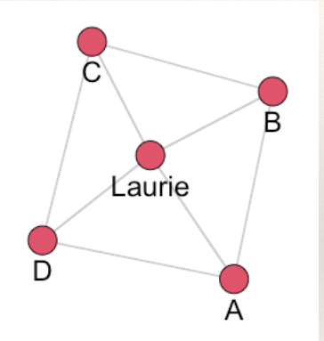
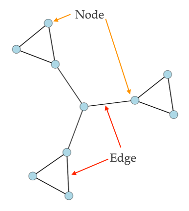
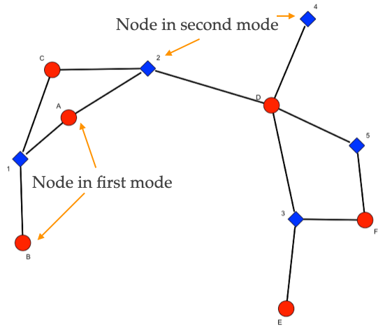

```{r setup, include=FALSE}
knitr::opts_chunk$set(echo = FALSE, message=FALSE, warning=FALSE, fig.width = 10)
library( here )
```

<br>

# Chapter 1: Introduction to Social Network Analysis

<br>

## Learning Goals

  * Be able to answer these questions:
  
    * What is "network science" and how is it different from "usual" research?
    
    * What do networks "look like"?
    
<br>

## Motivating Question and Empirical Example

To get a sense of what we do when we study networks, let's start with a motivating question:

*What determines whether a police officer endorses the use of body-worn cameras and whether they activate their body-camera during an incident?*

Most accounts tend to focus on several factors:

 * Individual characteristics (e.g. age, experience)
 * Situational characteristics (e.g. time of day, incident)

In the study of networks, we are interested in just that: **the network**! 

For example, in a study by [Young & Ready (2015)](https://journals.sagepub.com/doi/10.1177/1043986214553380) entitled, *Diffusion of Ideas and Technology: The Role of Networks in Influencing the Endorsement and Use of On-Officer Video Cameras*, the authors looked at two research questions:

  * How do police officers "frame" body-worn cameras?
  * Is the meaning officers attribute to cameras created and transmitted in groups?
  

To answer these questions, they proposed the following model:  

```{r, fig.cap = "", out.width = "60%"}
knitr::include_graphics( "images/ch-01-model-figure.jpeg" )
```

In this model, the argued that police officers views of body-worn cameras influence whether they use their cameras in incidents. Where do these views come from? The authors proposed a *contagion* process whereby officers who shared incidents together exchanged views about the legitimacy of body-worn cameras.

Thus, the network matters!

<br>

## Network Science

Network **science** is an approach to science that views the world as being composed of systems of actors connected through relational ties (i.e. a **network**).

  * *What are some ways people can be connected?*
  
Network science takes these **relational structures** as the primary domain of interest. In so doing, research questions take the following forms:

  * How does the network matter?
    * Here the network is an *independent variable*. In the case above, the network of shared incidents was as independent variable that influenced views of body-worn cameras.
  * What effects the network?
    * Here, the network is a *dependent variable*. Do younger individuals who are involved in crime have more co-offenders? 
    
<br>

## Network Analysis

Network **analysis** is the set of tools used to study *relational variables*. A set of methods for systematically understanding and identifying connections among actors. 

<u>Consider three different questions</u>:

  * Are kids who are risk-seeking more likely to drink alcohol?
  * Are kids who have friends that drink alcohol more likely to drink alcohol?
  * Are kids who drink alcohol more likely to be popular?

Now, think about this: How are these questions different? Is the causal logic the same? Are the policy implications the same? What are the variables?

The questions differ substantially in causal logic:

  * In the first question, the independent variable is risk-seeking and the dependent variable is alcohol consumption. In the second question, the independent variable is alcohol consumption among friends. These two questions have different policy implications. The first would focus on reducing risk-seeking. The second would focus on disrupting the network.
  
  * In the third question, the independent variable is alcohol consumption and the dependent variable is a network variable, popularity. The policy implication here would be to reduce alcohol consumption if we were concerned about who (or who is not) popular.
  
Here is another [example](https://www.theonion.com/sudden-death-of-aunt-creates-rupture-in-family-gossip-p-1819578447) from America's "finest news source", the Onion:

```{r, fig.cap = "", out.width = "60%"}
knitr::include_graphics( "images/ch-01-gossip.jpeg" )
```


Conceptually, what does this story tell us about the **relational structure** of information transmission in the Shelton family?

It is *vulnerable!*

To understand, we can draw a picture illustrating the network described in the story:

```{r, fig.cap = "", out.width = "30%"}
knitr::include_graphics( "images/ch-01-gossip-laurie-01.jpeg" )
```

What makes it vulnerable? What happened when aunt Laurie died?

```{r, fig.cap = "", out.width = "60%"}
knitr::include_graphics( "images/ch-01-gossip-laurie-02.jpeg" )
```

Communication is completed disrupted!

Now, consider a separate network arrangement:

```{r, fig.cap = "", out.width = "30%"}

```

Now what happens when aunt Laurie dies?

```{r, fig.cap = "", out.width = "60%"}
knitr::include_graphics( "images/ch-01-gossip-laurie-04.jpeg" )
```

Communication is *not* disrupted. This is because the network now has **redundant** ties which make it less vulnerable to disruption.

The point here is this: these topics are inherently *relational*. 

<br>

## Network Science and Network Analysis

In doing network research (i.e. asking questions that involve networks and performing network analysis to answer the question), it is important to consider two crucial ideas:

  * Conceptualization
    * The process of defining what a concept is by creating a conceptual definition. 
    * Network science **conceptualizes** theoretical concepts that are inherently relational.
    
  * Operationalization
    * The process of creating a concrete measure following a conceptual definition of a concept.
    * Network research **operationalizes** theoretical constructs by drawing on the formal properties of graphs.
    
Let's take an example. Suppose we are interested in the concept of *power* in a gang. Some gang members may be more powerful than others. But, what does it mean to say that someone is powerful? There are many different ways to conceptualize power. One way is to think about it as being central members of the gang. So, we could create a conceptual definition: powerful gang members are those who are central to the gang network. Ok, so how do we measure it? In other words, how do we operationalize power based on our conceptual definition? We could say that individuals who are central in the gang are those who are perceived as being central. So, we could ask gang members "who is the most central person in your gang?". Then, we would have an operationalization of power in the gang.

<br>

## Basic Data Elements

*What do networks "look like"?*

### Network (relational) data represents:

  * **Connections** (also called ties, arcs, edges, lines, ties) among,
  
  * **Entities** (also called nodes, vertices, actors, points, dots)
  
To be consistent, I will use the term *node* to refer to entities and *edge* to refer to connections. 

A *node* can be anything that can link to something else. Anything.

An *edge* can be anything that can record a connection between nodes. Anything.

Examples:

  * In a friendship network the nodes are individuals and the edges are friendships.

  * In a co-offending network the nodes are individuals and the edges are offense. That is, individuals are connected through an offense in which they both were present.

On a graph, nodes are represented by *points* and edges are represented by *lines*.

```{r, fig.cap = "", out.width = "30%"}

```

### Edges

#### Directionality

Edges can be *undirected*, where an edge from A to B is the same as an edge from B to A:

```{r, fig.cap = "", out.width = "30%"}
knitr::include_graphics( "images/ch-01-net-02.jpeg" )
```

or *directed*, where an edge from A to B is separate from an edge from B to A:

```{r, fig.cap = "", out.width = "30%"}

```

The difference is important. For example, suppose the edges of the networks below measure communication of information. 

```{r, fig.cap = "", out.width = "60%"}
knitr::include_graphics( "images/ch-01-net-04.jpeg" )
```

*How are these structures different?*

In the undirected network (on the left), all information can reach all three groups. To see this start at any node and you can reach any other node following the lines.

But, in the directed network (on the right), information is "stuck" in the three clusters. Why? This is because information comes from the center node and goes to each cluster. Even though the all communicate in each cluster, information does not leave the clusters. To see this, start with any node and follow the arrows. Once you get into a single cluster, you cannot leave!


#### Value

Edges can take on different values. They can be:

  * Binary (0 or 1; present or absent)
  * Valued integers (0, 1, 2,...)
  * Continuous weights (0.24, 1.79,...)
  * Signed (+ or -)
  
For example, in a friendship network we could be friends or not (binary), how strong our friendship is (either using integers or continuous measures), or we could like (signed +) or dislike (signed -) each other.

#### Meanings

Edges can have different meanings and therefore be of different *types*:
  * Social relationships (e.g. sister, friend, likes, knows)
  * Interactions (has sex with, talks to, seeks advice from)
  * Flows (diseases, attitudes, information)

These different types are important to keep in mind when we are thinking about what a tie represents. 


### Nodes

#### Modes/Node Partitions

Networks can differ with respect to the sets of nodes that define them. This refers to the modes of the network or the partitioning of the nodes:

  * One-mode/uni-partite (connections among one type of node). For example, A and B are friends. There is only one group of nodes, individuals.
  * Multi-mode/multi-partite (connections among two or more types of nodes). For example A and B attend protests 1, 2, and 3. There are two sets of nodes, individuals and protests. A and B are connected through their shared participation in the protests.

```{r, fig.cap = "", out.width = "30%"}

```

As an example, the network for the study discussed above by [Young & Ready (2015)](https://journals.sagepub.com/doi/10.1177/1043986214553380) is shown below:

```{r, fig.cap = "", out.width = "60%"}
knitr::include_graphics( "images/ch-01-net-06.jpeg" )
```

In this network, incidents (white circles) connect officers (squares and triangles). This is a two-mode/bipartite network because there are two sets of nodes: incidents and officers. The plot shows two types of officers, those who were in the treatment condition of the study (i.e. they were assigned a body-worn camera) and those who were in the control condition (i.e. they did not receive a camera). The focus of the study was how exposure to body-cameras during incidents influenced views, especially for those who were not assigned a camera.

As another example, [Schjarback & Young](https://link.springer.com/article/10.1007/s12103-017-9395-5) examined the tendency for United States senators to sign different types of legislation. Specifically, the authors were interested in whether crime control legislation was more likely to be signed if individuals were from the same party.

```{r, fig.cap = "", out.width = "60%"}
knitr::include_graphics( "images/ch-01-net-07.jpeg" )
```

In this network, there are two sets of nodes: bills (crime control and non-control) and senators (Democrats and Republicans).
  

#### Plexity

Networks can also differ with respect to the types of edges.

  * Simplex (connections among nodes are of one type)
  
  * Multiplex (connections among nodes are of multiple types)

For example, in the fictitious plot below, individual responded to three questions: "do you get along with this person?", "do you discuss important matters with this person?", and "is this person powerful/influential?"

```{r, fig.cap = "", out.width = "40%"}
knitr::include_graphics( "images/ch-01-net-08.jpeg" )
```

<br>

#### Summary

To summarize this section, the main take away is that *relational* data can take many different forms and be represented in many different ways.

<br>

#### Continue to [Chapter 2: Social Network Analysis and Theory](ch-02-sna-theory.html)

<br><br>

***Please*** report any corrections or comments to the [Issues](https://github.com/jacobtnyoung/sna-textbook/issues) page. Thanks!

<br><br>
