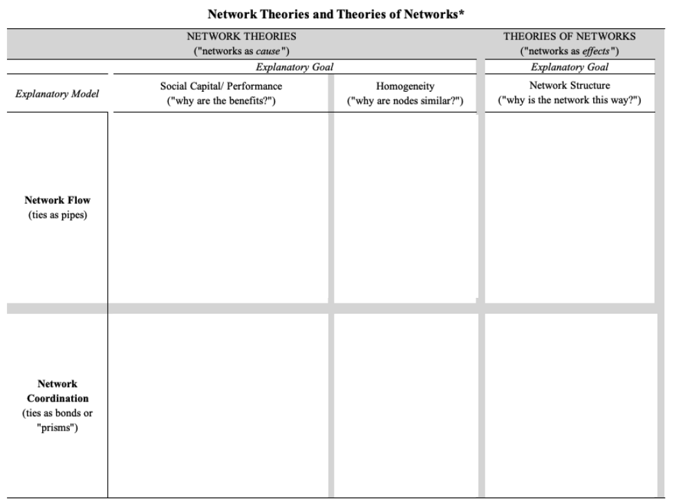

```{r setup, include=FALSE}
knitr::opts_chunk$set(echo = FALSE, message=FALSE, warning=FALSE, fig.width = 10)
library( here )
```

<br>

# Chapter 2: Social Network Analysis and Theory

<br>

## Learning Goals

  * Be able to answer these questions:
  
    * Understand the theoretical basis of network science
<br>

## Organizing Knowledge

As discussed in [Chapter 1: Introduction to Social Network Analysis](), network science takes **relational structures** as the primary domain of interest. In so doing, research questions take the following forms:

  * How does the network matter?
    * Here the network is an *independent variable*. In the case above, the network of shared incidents was as independent variable that influenced views of body-worn cameras.
  * What effects the network?
    * Here, the network is a *dependent variable*. Do younger individuals who are involved in crime have more co-offenders? 

Building from this, we can think about organizing social network analyses around the following general classification of ideas:

  * Network Theories (networks as "cause")
  * Theories of Networks (networks as "effect")
  
We can classify studies based on the **Explanatory Model** (what is the metaphor for the network?) and the **Explanatory Goal** (what are we trying to explain?). 

The Explanatory model differentiates between two different metaphors for what networks do: *flow* (where "stuff" flows through ties like a pipe) and *coordination* (ties are like bonds in that they coordinate action)

The Explanatory goal differentiates between what we are trying to understand: *social capital/performance* (what are the benefits of a position? How does it render advantage?), *homogeneity* (why are nodes similar?), and *network structure* (why is the network like this?).

These dimensions give as a 2x3 table where by which we can better classify studies:

```{r, fig.cap = "", out.width = "60%"}

```

<br>  
  
## Mechanisms in Network Theory

<br>

### Capitalization

Model: Flow
Goal: Social Capital/Performance

This mechanism explains the benefits of social ties as providing resources. That is, individuals are able to *capitalize* on their ties and this produces variation in resources.

As an example, consider the following question: why do some people stay out of prison when they return to the community?

Several studies (CITES) point to the importance of social support upon reentry. Individuals who are able to draw on a diverse set of resources in their social network are better able to navigate life on the outside.

<br>

### Contagion

Model: Flow
Goal: Homogeneity

This mechanism explains homogeneity among nodes as the result of an "infection" process. That is, individuals are similar because of their exposure in their social network.

As an example, think about this question: why are people victims of gun violence?

A study by CITE suggests that exposure to particular behavioral settings increases the risk of gun violence. Specifically, being around those who have been the victim of gun violence. These situations think of victimization in epidemiological terms.

<br>

#### Continue to [Chapter 3: Social Network Analysis and Methods for Data Collection](ch-03-sna-methods.html)

<br><br>

***Please*** report any corrections or comments to the [Issues](https://github.com/jacobtnyoung/sna-textbook/issues) page. Thanks!

<br><br>