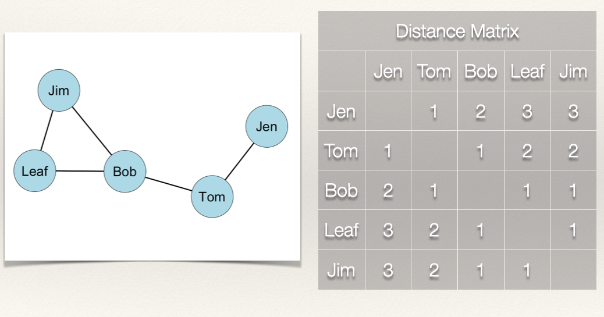
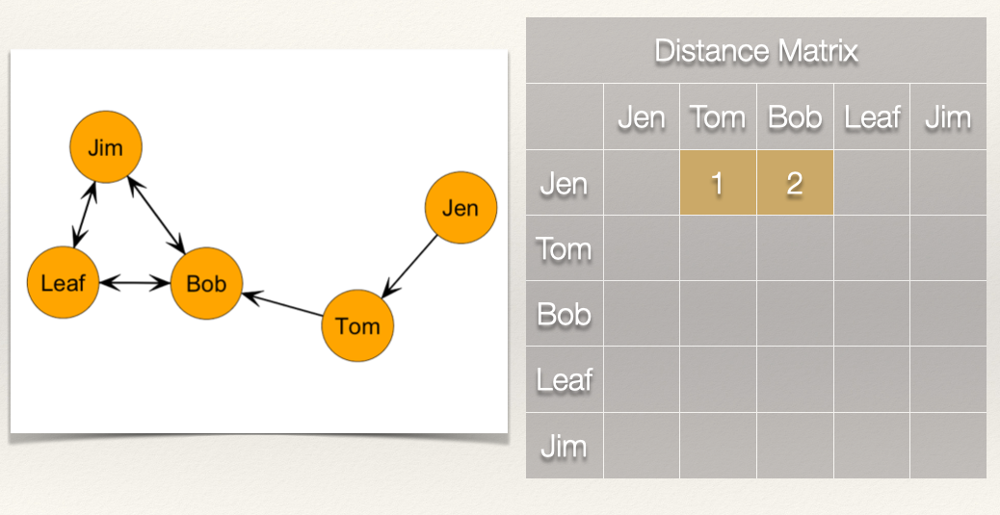
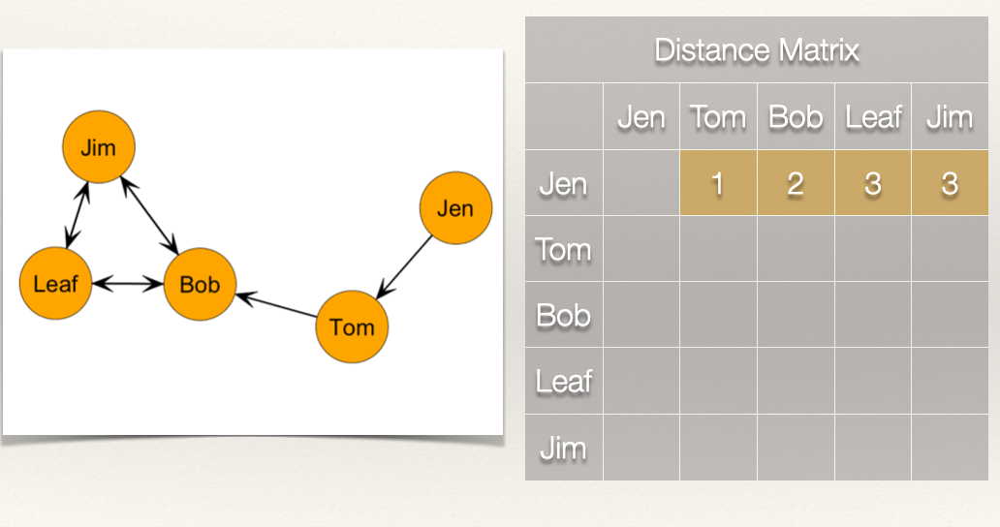

```{r setup, include=FALSE}
knitr::opts_chunk$set( echo = FALSE, message=FALSE, warning=FALSE, fig.width = 10 )
library( here )
```

```{r net-setup, results="hide", fig.show="hide"}

rm( list = ls() )
library( network )
library( RColorBrewer )
library( sna )

## Set up the objects that will be used in the lecture ----

# Undirected graph ----

u.mat <- rbind(
  c( 0,1,0,0,0 ),
  c( 1,0,1,0,0 ),
  c( 0,1,0,1,1 ),
  c( 0,0,1,0,1 ),
  c( 0,0,1,1,0 ) )
rownames( u.mat ) <- c( "Jen","Tom","Bob","Leaf","Jim" )
colnames( u.mat ) <- c( "Jen","Tom","Bob","Leaf","Jim" )
u.net <- network( u.mat, matrix.type = "adjacency", directed = FALSE )
u.c.mat <- u.mat
u.c.mat[u.mat == 0] <- 1
diag( u.c.mat ) <- 0


# Directed graph ----

d.mat <- rbind(
  c( 0,1,0,0,0 ),
  c( 0,0,1,0,0 ),
  c( 0,0,0,1,1 ),
  c( 0,0,1,0,1 ),
  c( 0,0,1,1,0 ) )
rownames( d.mat ) <- c( "Jen","Tom","Bob","Leaf","Jim" )
colnames( d.mat ) <- c( "Jen","Tom","Bob","Leaf","Jim" )
d.net <- network( d.mat, matrix.type = "adjacency", directed = TRUE )
d.c.mat <- d.mat
d.c.mat[d.mat == 0] <- 1
diag( d.c.mat ) <- 0


# Objects for standardization ----

graph.a <- as.matrix( 
  rbind( 
    c( 0,1,0 ),
    c( 1,0,1 ),
    c( 0,1,0 ) ),
  byrow=TRUE,ncol=3 )
graph.b <- as.matrix( 
  rbind( 
    c( 0,1,1,1 ),
    c( 1,0,1,1 ),
    c( 1,1,0,1 ), 
    c( 1,1,1,0 ) ),
  byrow=TRUE,ncol=4 )


# Plots to show differences in centralization ----

dum1 <- rbind( c( 1,2 ), c( 1,3 ), c( 1,4 ), c( 1, 5) )
star_net <- network( dum1, directed=FALSE )
dum2 <- rbind( c( 1,2 ),c( 2,3 ),c( 3,4 ),c( 4,5 ),c( 5,1 ) ) 
circle_net <- network( dum2, directed=FALSE )


```

<br>

# Chapter 6: Closeness Centrality

<br>

## Learning Goals

  * Revisit the conceptualization of "centrality".
  
  * Understand the calculation of *closeness* centrality.

<br>

## Concepts and Operationalization

When we say a *node* is "central", what do we mean conceptually? Think of a few examples (again).

<br>

### Conceptualization

“Everyone agrees, it seems, that centrality is an important structural attribute of networks. All concede that it is related to a high degree to other important group properties and processes. But there consensus ends.” ([Freeman](), 1978/1979: 217)

The type of measure we use depends on the substantive question of interest. Various measures of centrality are correlated, but they *operationalize* different concepts. Put differently, there is not a single measure of centrality because what we mean by "centrality" can differ.

<br>

### Closeness Centrality

How *close* is a node to other nodes? *Closeness* centrality measures how near a node is to the other nodes in the network. That is, how "close" the nodes are. What we mean by "close" will differ based on whether the graph is undirected or directed. By the conceptual definition is the same. How close nodes are in a graph is based on the inverse of the distance of each node to every other node. 

Terminology:
  
  * A **path** is an edge or sequence of edges that connect two nodes.
  * A **geodesic** is the shortest path between two nodes.
  * The **distance**, $d(n_i,n_j)$, is the length of the path between *i* and *j*. 

Another way of saying this is that if we now how "far apart" two nodes are (i.e. the distance), then we can take the inverse of that and know how "close" the nodes are to each other.

<br>

## Undirected Graphs

For an undirected binary graph, the closeness is: 

$$C_C(n_i) = [\sum\limits_{j=1}^g d(n_i,n_j)]^{-1}$$

This reads as: Find the distance between two nodes *i* and *j*, $d(n_i,n_j)$, sum them, and then take the inverse.

Another way to write this is as:

$$C_C(n_i) = [\sum\limits_{j=1}^g d(n_i,n_j)]^{-1} = \frac{1}{[\sum\limits_{j=1}^g d(n_i,n_j)]}$$

In words, the closeness is 1 divided by the sum of the distances (called the *reciprocal*).
  
<br>  
  
To find the closeness centrality score, we need to first find the distances between each node. We can express these distances using a matrix, just like we did with the sociomatrix before. 

Let's take a look at this with some data. Recall our example network with Jen, Tom, Bob, Leaf, and Jim:

```{r, echo=FALSE, eval=TRUE, fig.width=5, fig.height=5, fig.show="show", fig.align="center"}

gplot( u.mat, gmode = "graph", displaylabels = TRUE, label.pos = 5, label.cex = 1.2, vertex.col = "lightblue", vertex.cex=3.2 )

```

<br>

For our graph, we want to first build a *distance matrix* which shows the value of the geodesic (i.e. shortest path) from *i* to *j*.

```{r, fig.cap = "", out.width = "60%"}
knitr::include_graphics( "images/ch-06-matrix-01.jpeg" )
```

<br>

In the graph, how far is Jen from Tom? How far is Jen from Bob? In other words, how many edges do we count in going from Jen to Tom? From Jen to Bob?

```{r, fig.cap = "", out.width = "60%"}

```

<br>

We can see that Jen can reach Tom in 1 step (i.e. $L_{Jen,Tom}$) and that Jen can reach Bob in 2 steps (i.e. $L_{Jen,Tom}$ & $L_{Tom,Bob}$).

What about the rest of the distance matrix?

```{r, fig.cap = "", out.width = "60%"}
knitr::include_graphics( "images/ch-06-matrix-03.jpeg" )
```

<br>

If we follow what we did above, then we get the following distance matrix:

```{r, fig.cap = "", out.width = "60%"}

```

<br>

Since the graph is undirected, the distance matrix is symmetric. That is, $d(n_i,n_j) = d(n_j,n_i)$. 

```{r, fig.cap = "", out.width = "60%"}

```

<br>

Now, it we take the sum of the rows, this gives us $\sum\limits_{j=1}^g d(n_i,n_j)$. 

```{r, fig.cap = "", out.width = "60%"}
knitr::include_graphics( "images/ch-06-matrix-06.jpeg" )
```

<br>

Note that since the graph is undirected, the column sum would give us the same values.

Since we have $\sum\limits_{j=1}^g d(n_i,n_j)$, all we need to do now is take the reciprocal by dividing 1 by $\sum\limits_{j=1}^g d(n_i,n_j)$:

$$C_C(n_i) =  \frac{1}{[\sum\limits_{j=1}^g d(n_i,n_j)]}$$

That gives us the closeness centrality score for each individual:


| Node  | Distance | Closeness   |
| :---: | :------: | :---------: |
| Jen   | 9        | 1/9 = 0.111 |
| Tom   | 6        | 1/6 = 0.167 |
| Bob   | 5        | 1/5 = 0.200 |
| Leaf  | 7        | 1/7 = 0.143 |
| Jim   | 7        | 1/7 = 0.143 |

<br>

### Standardization

As discussed in the chapter on [degree centrality](), the measure of centrality is affected (effected?) by the size of the graph, *g*. In the case of *closeness* centrality, having to sum over more nodes will push scores closer to zero. This means that we can't compare closeness centrality scoress across graphs of different sizes. *Solution*?

Standardize! If we want to compare nodes in different sized networks, then we just take into account the number of nodes and the maximum possible nodes to which *i* could be connected. In an undirected graph, this is *g-1*.

Thus, we can calculate a standardized closeness centrality for an undirected graph as:

$$C'_C(n_i) = [\sum\limits_{j=1}^g d(n_i,n_j)]^{-1} \times [g-1]$$

For this graph, the denominator, *g-1* is $5 - 1 = 4$. Plugging that in we get: $C'_C(n_i) = [\sum\limits_{j=1}^g d(n_i,n_j)]^{-1} \times 4$.


| Node  | Distance | Closeness   | Standardized Closeness   |
| :---: | :------: | :---------: | :----------------------: |
| Jen   | 9        | 1/9 = 0.111 | 0.111*4 = 0.444          |
| Tom   | 6        | 1/6 = 0.167 | 0.167*4 = 0.668          |
| Bob   | 5        | 1/5 = 0.200 | 0.200*4 = 0.800          |
| Leaf  | 7        | 1/7 = 0.143 | 0.143*4 = 0.572          |
| Jim   | 7        | 1/7 = 0.143 | 0.143*4 = 0.572          |

<br>

Standardization is particularly important with closeness centrality because of the sensitivity of the measure to the size of the network. Take for example, the following networks:

```{r, echo=FALSE, eval=TRUE, fig.width=5, fig.height=5, fig.show="show", fig.align="center"}

par( mar=c( 0.1,0.5,1,0.5 ), mfrow = c( 1,2 ) )

set.seed( 605 )
gplot( graph.a, 
       usearrows=FALSE, 
       vertex.cex=3.2, 
       vertex.col = c( "lightblue","white","white" ), 
       edge.col="grey50", 
       label=c( "0.33","","" ), 
       label.pos=5, 
       label.cex = 1.2,
       main = "Network A: Raw")

set.seed( 605 )
gplot( graph.b, 
       usearrows=FALSE, 
       vertex.cex=3.2, 
       vertex.col = c( "orange","white","white","white" ), 
       edge.col="grey50",label=c( "0.33","","","" ),
       label.pos=5, 
       label.cex = 1.2,
       main = "Network B: Raw")

```

<br>

The plot above shows two different graphs with the *raw* closeness centrality scores for two nodes. Note that they have the exact same score. Yet, would you say they are equally close to other nodes in the network? In other words, that their closeness to other nodes is the same?

When we standardize, we adjust for the size of the network:

<br>

```{r, echo=FALSE, eval=TRUE, fig.width=5, fig.height=5, fig.show="show", fig.align="center"}

par( mar=c( 0.1,0.5,1,0.5 ), mfrow = c( 1,2 ) )

set.seed( 605 )
gplot( graph.a, 
       usearrows=FALSE, 
       vertex.cex=3.2, 
       vertex.col = c( "lightblue","white","white" ), 
       edge.col="grey50", 
       label=c( "0.66","","" ), 
       label.pos=5, 
       label.cex = 1.2,
       main = "Network A: Standardized")

set.seed( 605 )
gplot( graph.b, 
       usearrows=FALSE, 
       vertex.cex=3.2, 
       vertex.col = c( "orange","white","white","white" ), 
       edge.col="grey50",label=c( "1.00","","","" ),
       label.pos=5, 
       label.cex = 1.2,
       main = "Network B: Standardized")


```

<br>

```{r, echo=FALSE, eval=TRUE, fig.width=5, fig.height=5, fig.show="show", fig.align="center"}

par( mar=c( 0.1,0.5,1,0.5 ), mfrow = c( 1,2 ) )

set.seed( 605 )
gplot( graph.a, 
       usearrows=FALSE, 
       vertex.cex=3.2, 
       vertex.col = "lightblue",
       edge.col="grey50", 
       label=c( "0.66","1","0.66" ), 
       label.pos=5, 
       label.cex = 1.2,
       main = "Network A: Standardized")

set.seed( 605 )
gplot( graph.b, 
       usearrows=FALSE, 
       vertex.cex=3.2, 
       vertex.col = "orange", 
       edge.col="grey50",label=c( "1","1","1","1" ),
       label.pos=5, 
       label.cex = 1.2,
       main = "Network B: Standardized")


```

<br>

### Closeness Centralization

As we did with [degree centralization](), we can calculate the closeness centralization of the graph. Recall that centralization measures the extent to which the nodes in a social network differ from one another in their individual centrality scores. Put differently, how much variation is there in the distribution of centrality scores? A key difference, however, is that for closeness centralization, we use the standardized closeness score.

We can calculate closeness centralization as:

$$C_C = \frac{\sum\limits_{i=1}^g[C'_C(n^*)-C'_C(n_i)]}{[(g-2)(g-1)]/(2g-3)}$$

This may look imposing, but we can decompose it to see what it is doing:

  * $C'_C(n^*)$ is the largest standardized closeness score
  * $C'_C(n_i)$ is the standardized closeness score for node *i*
  * $\sum\limits_{i=1}^g[C'_C(n^*)-C'_C(n_i)]$ simply takes the sum of deviations for each node from the largest value
  * Finally, we take that sum and divide it by $[(g-2)(g-1)]/(2g-3)$

If I lost you in some of the math, don't worry. Let's calculate the closeness centralization score for our example graph:

<br>

```{r, echo=FALSE, eval=TRUE, fig.width=5, fig.height=5, fig.show="show"}

gplot( u.mat, gmode = "graph", displaylabels = TRUE, label.pos = 5, label.cex = 1.2, vertex.col = "lightblue", vertex.cex=3.2 )

```

<br>

Recall our table of standardized closeness scores:

| Node  | Distance | Closeness   | Standardized Closeness   |
| :---: | :------: | :---------: | :----------------------: |
| Jen   | 9        | 1/9 = 0.111 | 0.111*4 = 0.444          |
| Tom   | 6        | 1/6 = 0.167 | 0.167*4 = 0.668          |
| Bob   | 5        | 1/5 = 0.200 | 0.200*4 = 0.800          |
| Leaf  | 7        | 1/7 = 0.143 | 0.143*4 = 0.572          |
| Jim   | 7        | 1/7 = 0.143 | 0.143*4 = 0.572          |

*What is the largest standardized closeness score?* It is 0.8 for Bob. Also, we have $g = 5$. Now, we just plug these into our equation:

$$C_C = \frac{\sum\limits_{i=1}^g[0.800-C'_C(n_i)]}{[(5-2)(5-1)]/(2*5-3)}$$
<br>

| Node  | Distance | Closeness   | Standardized Closeness   | Deviations of Standardized Closeness $0.800-C'_C(n_i)$ |
| :---: | :------: | :---------: | :----------------------: | :----------------------------------------------------: |
| Jen   | 9        | 1/9 = 0.111 | 0.111*4 = 0.444          | 0.800 - 0.444 = 0.356 |
| Tom   | 6        | 1/6 = 0.167 | 0.167*4 = 0.668          | 0.800 - 0.668 = 0.132 |
| Bob   | 5        | 1/5 = 0.200 | 0.200*4 = 0.800          | 0.800 - 0.800 = 0.000 |
| Leaf  | 7        | 1/7 = 0.143 | 0.143*4 = 0.572          | 0.800 - 0.572 = 0.228 |
| Jim   | 7        | 1/7 = 0.143 | 0.143*4 = 0.572          | 0.800 - 0.572 = 0.228 |

<br>

Now, if we total all of the values in the last column we get 0.944. Plugging this in as our numerator, we get:

$$C_C = \frac{0.944}{[(5-2)(5-1)]/(2*5-3)} = \frac{0.944}{1.714} = 0.5507585 \approx 0.551$$

So, the closeness centralization score for our example graph is 0.551. *What does this mean?*

When closeness centrality is evenly dispersed, meaning that all nodes have the same closeness score, then the numerator in the equation will be zero and the quotient will be close to 0. When there is considerable inequality in the closeness centrality scores between nodes, the quotient will be closer to 1. Thus, closer to 1 indicates that the graph is hierarchically structured and closer to 0 means that the graph is more decentralized.

We can see this by examining two additional undirected networks. 

<br>

```{r, echo=FALSE, eval=TRUE, fig.width=5, fig.height=5, fig.show="show", fig.align="center"}

centralization( star_net, closeness, mode="graph" )
centralization( circle_net, closeness, mode="graph" )

par( mar=c( 4,4,0.1,0.1 ), mfrow = c( 1,2 ) )

my_pal <- brewer.pal( 5,"Set2" )

gplot( star_net,
       usearrows=FALSE, 
       displayisolates=FALSE, 
       vertex.cex=2, 
       vertex.col=my_pal[1], 
       edge.lwd=0, 
       edge.col="grey50",
       label=c( "A","B","C","D","E" ),
       label.pos=5 )

gplot( circle_net, 
       usearrows=FALSE, 
       displayisolates=FALSE, 
       vertex.cex=2,
       vertex.col=my_pal[3], 
       edge.lwd=0, 
       edge.col="grey50",
       label=c( "F","G","H","I","J" ),
       label.pos=5 )

```

The closeness centralization score for the figure on the left is `r centralization( star_net, closeness, mode="graph" )`, whereas the closeness centralization score for the figure on the right is `r centralization( circle_net, closeness, mode="graph" )`. 


<br>

## Directed Graphs

As discussed in [CHAPTER](), when we have a directed graph, we have to consider directionality when evaluating a centrality measure. For example, in the graph below, *how far is Jen from Tom?* *How far is Jen from Bob?*

```{r, echo=FALSE, eval=TRUE, fig.width=5, fig.height=5, results="show"}

gplot( d.mat, gmode = "digraph", displaylabels = TRUE, label.pos = 5, label.cex = 1.2, vertex.col = "orange", vertex.cex=3.2 )

```

To answer this question, let's think again about what closeness measures. It is the inverse of the distance matrix. So, if we are looking at outgoing ties (i.e. $L(n_i,n_j)$) then our equation is the same for the undirected graph:

$$C_C(n_i) = [\sum\limits_{j=1}^g d(n_i,n_j)]^{-1} = \frac{1}{[\sum\limits_{j=1}^g d(n_i,n_j)]}$$

Note, however, that the distance of *i* to *j*, $d(n_i,n_j)$, does not necessarily equal the distance from *j* to *i*, $d(n_j,n_i)$. For example, the distance from Jen to Tom, $d(Jen,Tom)$, is 1. But, the distance from Tom to Jen, $d(Tom,Jen)$ is....? It is undefined because there is not a edge from Tom to Jen. This complicates things a bit. Let's work through an example to see what this looks like.

As before, we want to first build a *distance matrix* which shows the value of the geodesic (i.e. shortest path) from *i* to *j*.

```{r, fig.cap = "", out.width = "60%"}
knitr::include_graphics( "images/ch-06-matrix-07.jpeg" )
```

<br>

*How far is Jen from Tom?* *How far is Jen from Bob?*

```{r, fig.cap = "", out.width = "60%"}

```

<br>

Jen is 1 step from Tom and 2 steps from Bob. *What about the rest of the scores for Jen?*

```{r, fig.cap = "", out.width = "60%"}

```

<br>

Now, recall that we sum these distances, and then take the reciprocal:

$$C_C(Jen) =  \frac{1}{[\sum\limits_{j=1}^g d(Jen,n_j)]} = \frac{1}{9} = 0.111$$
*What about Bob? How far is Bob from everyone?*

```{r, fig.cap = "", out.width = "60%"}

```

<br>

How far is Bob from Jen? Bob, is "infinite distance" from Jen because there is not a directed path by when he can reach her. This is the same for the distance from Bob to Tom. But, Bob does have directed ties to Jim and Leaf.

```{r, fig.cap = "", out.width = "60%"}
knitr::include_graphics( "images/ch-06-matrix-11.jpeg" )
```

<br>

So what is Bob's closeness centrality score? If we do not count the cells that have "infinite distance", effectively treating these as zeros, then we just count the distance for Leaf and Jim, which sums to 2. We just plug this in:

$$C_C(Bob) =  \frac{1}{[\sum\limits_{j=1}^g d(Bob,n_j)]} = \frac{1}{2} = 0.500$$

Going through the rest of the matrix, we get a closeness centrality score for each individual:

| Node  | Distance | Closeness   |
| :---: | :------: | :---------: |
| Jen   | 9        | 1/9 = 0.111 |
| Tom   | 5        | 1/5 = 0.200 |
| Bob   | 2        | 1/2 = 0.500 |
| Leaf  | 2        | 1/2 = 0.500 |
| Jim   | 2        | 1/2 = 0.500 |


### Standardization

As before, we can standardize our closeness score as:

$$C'_C(n_i) = [\sum\limits_{j=1}^g d(n_i,n_j)]^{-1} \times [g-1]$$

| Node  | Distance | Closeness   | Standardized Closeness   |
| :---: | :------: | :---------: | :----------------------: |
| Jen   | 9        | 1/9 = 0.111 | 0.111*4 = 0.444          |
| Tom   | 5        | 1/5 = 0.200 | 0.200*4 = 0.800          |
| Bob   | 2        | 1/2 = 0.500 | 0.500*4 = 0.200          |
| Leaf  | 2        | 1/2 = 0.500 | 0.500*4 = 0.200          |
| Jim   | 2        | 1/2 = 0.500 | 0.500*4 = 0.200          |

<br>

Note that when we are looking at *outgoing* ties, as we did above, this tells us how close a node is to other nodes. For example, Tom's total distance is 5, meaning that in total, he is 5 steps from the other nodes in the graph. 

We can reverse this and look at the *incoming* ties. This would tell us how close the other nodes are to a particular node. This is a bit nuanced, by the difference is meaningful. In this case, instead of summing the rows as we did above, we could sum the columns.

```{r, fig.cap = "", out.width = "60%"}
knitr::include_graphics( "images/ch-06-matrix-12.jpeg" )
```

<br>

If we sum the columns, then we get these scores:

| Node  | Distance | Closeness       |
| :---: | :------: | :-------------: |
| Jen   | 0        | 1/0 = Undefined |
| Tom   | 1        | 1/1 = 1.000 |
| Bob   | 5        | 1/5 = 0.200 |
| Leaf  | 7        | 1/7 = 0.143 |
| Jim   | 7        | 1/2 = 0.143 |

While these are correct, mathematically, they are far less intuitive than the scores we calculated based on the *outgoing* ties. 

<br>

## Summary

In this chapter, we:

  * Revisited the conceptualization of "centrality" to discuss a different way of thinking about being central. Specifically, the idea that actors who are "closer" to others are more central.
  
  * We also covered the calculation of *closeness* centrality for directed an undirected graphs.
  
<br>

#### Continue to [Chapter 7: Betweenness Centrality](ch-07-centrality-betweenness.html)

<br><br>

***Please*** report any corrections or comments to the [Issues](https://github.com/jacobtnyoung/sna-textbook/issues) page. Thanks!

<br><br>
