```{r setup, include=FALSE}
knitr::opts_chunk$set( echo = FALSE, message=FALSE, warning=FALSE, fig.width = 10, fig.align = "center" )
library( here )
```

```{r net-setup, results="hide", fig.show="hide"}

rm( list = ls() )
library( network )
library( RColorBrewer )
library( sna )

## Set up the objects that will be used in the lecture ----

# Undirected graph ----

u.mat <- rbind(
  c( 0,1,0,0,0 ),
  c( 1,0,1,0,0 ),
  c( 0,1,0,1,1 ),
  c( 0,0,1,0,1 ),
  c( 0,0,1,1,0 ) )
rownames( u.mat ) <- c( "Jen","Tom","Bob","Leaf","Jim" )
colnames( u.mat ) <- c( "Jen","Tom","Bob","Leaf","Jim" )
u.net <- network( u.mat, matrix.type = "adjacency", directed = FALSE )
u.c.mat <- u.mat
u.c.mat[u.mat == 0] <- 1
diag( u.c.mat ) <- 0


# Directed graph ----

d.mat <- rbind(
  c( 0,1,0,0,0 ),
  c( 0,0,1,0,0 ),
  c( 0,0,0,1,1 ),
  c( 0,0,1,0,1 ),
  c( 0,0,1,1,0 ) )
rownames( d.mat ) <- c( "Jen","Tom","Bob","Leaf","Jim" )
colnames( d.mat ) <- c( "Jen","Tom","Bob","Leaf","Jim" )
d.net <- network( d.mat, matrix.type = "adjacency", directed = TRUE )
d.c.mat <- d.mat
d.c.mat[d.mat == 0] <- 1
diag( d.c.mat ) <- 0


# Objects for standardization ----

graph.a <- as.matrix( 
  rbind( 
    c( 0,1,0 ),
    c( 1,0,1 ),
    c( 0,1,0 ) ),
  byrow=TRUE,ncol=3 )
graph.b <- as.matrix( 
  rbind( 
    c( 0,1,1,1 ),
    c( 1,0,1,1 ),
    c( 1,1,0,1 ), 
    c( 1,1,1,0 ) ),
  byrow=TRUE,ncol=4 )


# Plots to show differences in centralization ----

dum1 <- rbind( c( 1,2 ), c( 1,3 ), c( 1,4 ), c( 1, 5) )
star_net <- network( dum1, directed=FALSE )
dum2 <- rbind( c( 1,2 ),c( 2,3 ),c( 3,4 ),c( 4,5 ),c( 5,1 ) ) 
circle_net <- network( dum2, directed=FALSE )


```

<br>

# Chapter 7: Betweenness Centrality

<br>

## Learning Goals

  * Revisit the conceptualization of "centrality".
  
  * Understand the calculation of *betweenness* centrality.

<br>

## Concepts and Operationalization

When we say a *node* is "central", what do we mean conceptually? Think of a few examples (again).

<br>

### Conceptualization

“Everyone agrees, it seems, that centrality is an important structural attribute of networks. All concede that it is related to a high degree to other important group properties and processes. But there consensus ends.” ([Freeman](), 1978/1979: 217)

The type of measure we use depends on the substantive question of interest. Various measures of centrality are correlated, but they *operationalize* different concepts. Put differently, there is not a single measure of centrality because what we mean by "centrality" can differ.

<br>

### Betweenness Centrality

With [*degree* centrality]() we conceptualized a central node as one that has a high number of ties. With [*closeness* centrality](), we conceptualized a central node as one that is close to others in the network. 

We can also conceptualize centrality as a node that lies on a particular path **between** other nodes. *Betweenness* centrality is based on the number of shortest paths between two nodes, *j* and *k*, that node *i* resides on. Recall that a **path** is an edge or sequence of edges that connect two nodes and a **geodesic** is the shortest path between two nodes.

<br>
<br>
<hr>

## Undirected Graphs

For an undirected binary graph, betweenness centrality is: 

$$C_B(n_i) = \sum\limits_{j<k} g_{jk}(n_i) / g_{jk}$$

This equation is a bit different from those for [degree]() and [closeness]() centrality. Let's unpack it:

  * The denominator, $g_{jk}$, is the number of geodesics linking *j* to *k*.
  * The numerator, $g_{jk}(n_i)$, is the number of geodesics linking *j* and *k* that contain *i*.  
  * Betweenness centrality is the ratio of the geodesics between *j* and *k* that contain *i*.

In words, if *j* has to go through *i* to reach *k*, $j-i-k$, then *i* will have high betweenness because *i* is **between** *j* and *k*.

<br>  
  
Let's consider an example. Take a look at this graph:  

```{r, echo=FALSE, eval=TRUE, fig.width=5, fig.height=5, fig.show="show", fig.align="center"}

par( mar=c( 1, 0.1, 1, 0.1 ) )

set.seed( 19141 )

gplot( u.mat, 
       usearrows=FALSE, 
       vertex.cex=3, 
       vertex.col = "lightblue", 
       edge.col="grey50", 
       displaylabels = TRUE, 
       label.pos=5, 
       label.cex = 1 )

```

*What are the paths between Jen and Jim?* There are two:

  * Jen to Tom to Bob to Jim
  * Jen to Tom to Bob to Leaf to Jim

We can see this visually:

<br>

```{r, echo=FALSE, eval=TRUE, fig.width=5, fig.height=5, fig.show="show", fig.align="center", results=FALSE}

par( mar=c( 1, 0.1, 1, 0.1 ), mfrow = c( 2,1 ) )

set.seed( 19141 )
gplot( u.net, 
       usearrows=FALSE, 
       vertex.cex=4, 
       vertex.col = "lightblue", 
       displaylabels = TRUE, 
       label.pos=5, 
       label.cex = 1,
       main = "Jen to Tom to Bob to Jim",
       edge.col = c("green","green","grey50","green","grey50" ) )

set.seed( 19141 )
gplot( u.net, 
       usearrows=FALSE, 
       vertex.cex=4, 
       vertex.col = "lightblue", 
       displaylabels = TRUE, 
       label.pos=5, 
       label.cex = 1,
       main = "Jen to Tom to Bob to Leaf to Jim",
       edge.col = c("green","green","green","grey50","green" ) )


```

<br>

Note that Bob is on both of those paths. He is between Jen and Jim on both paths. Note, however, that only one of the paths is a geodesic path. The Jen to Tom to Bob to Jim path. That is because it is shorter.

Let's calculate the betweenness centrality for Bob. The first thing we need to find are the geodesic paths. Then, figure out how many of those geodesic paths contain Bob. We do this be creating a table of geodesic proportions for Bob.

```{r, fig.cap = "", out.width = "40%"}
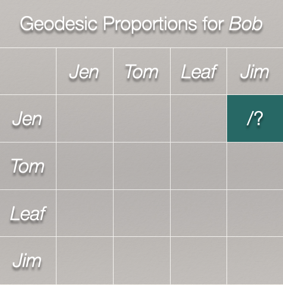
```

<br>

*How many geodesics from Jen to Jim?*

```{r, fig.cap = "", out.width = "40%"}

```

<br>

There is 1 geodesic from Jen to Jim. How many geodesics from Jen to Jim include Bob?

```{r, fig.cap = "", out.width = "40%"}
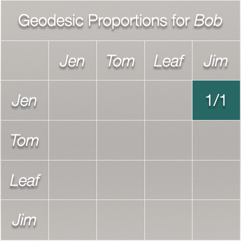
```

<br>

Bob is on the only geodesic between Jen and Jim. 

What about Jen to Tom?

```{r, fig.cap = "", out.width = "40%"}
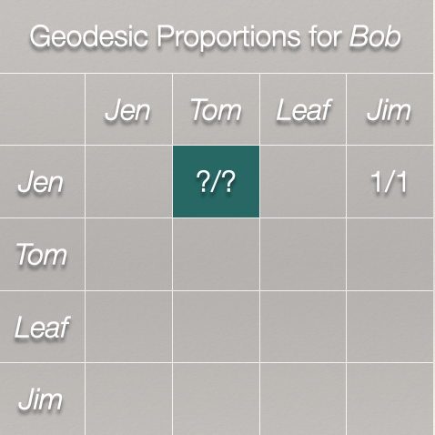
```

<br>

```{r, echo=FALSE, eval=TRUE, fig.width=5, fig.height=5, fig.show="show"}

par( mar=c( 1, 0.1, 1, 0.1 ) )

set.seed( 19141 )

gplot( u.net, 
       usearrows=FALSE, 
       vertex.cex=3.2, 
       vertex.col = "lightblue", 
       displaylabels = TRUE, 
       label.pos=5, 
       label.cex = 1.5,
       main = "Jen to Tom",
       edge.col = c("green","grey50","grey50","grey50","grey50" ) )

```

We can see from the plot that Bob is not on the only geodesic from Jen to Tom. So, that leads to:

```{r, fig.cap = "", out.width = "40%"}
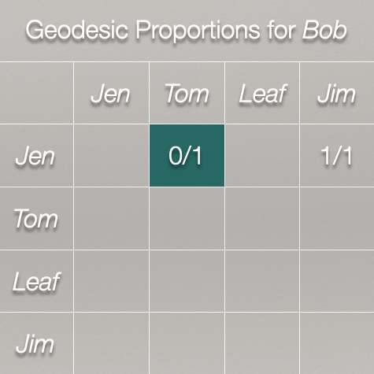
```

<br>

Finally, we can look at the Jen to Leaf path:

<br>

```{r, echo=FALSE, eval=TRUE, fig.width=5, fig.height=5, fig.show="show", fig.align="center"}

par( mar=c( 1, 0.1, 1, 0.1 ) )

set.seed( 19141 )

gplot( u.net, 
       usearrows=FALSE, 
       vertex.cex=3.2, 
       vertex.col = "lightblue", 
       displaylabels = TRUE, 
       label.pos=5, 
       label.cex = 1.5,
       main = "Jen to Tom to Bob to Leaf",
       edge.col = c("green","green","green","grey50","grey50" ) )

```

```{r, fig.cap = "", out.width = "40%"}
knitr::include_graphics( "images/ch-07-matrix-06.jpeg" )
```

<br>

Of the geodesics between $Jen,Tom$, $Jen,Leaf$, and $Jen,Tom$, how many include Bob?

```{r, fig.cap = "", out.width = "40%"}
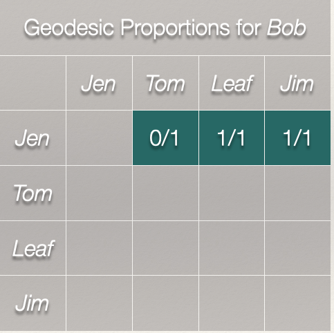
```

<br>

We just some the ratios across the row. It gives us 2.

Now, to finish our calculation for Bob, we need to calculate the geodesics for the rest of the matrix:

```{r, fig.cap = "", out.width = "40%"}
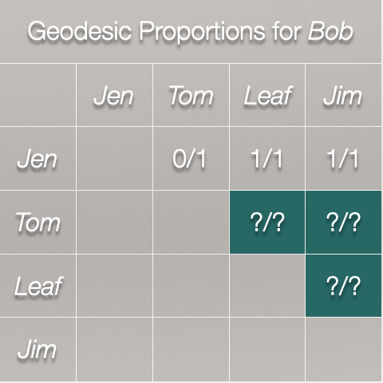
```

<br>

That gives us this matrix:

```{r, fig.cap = "", out.width = "40%"}
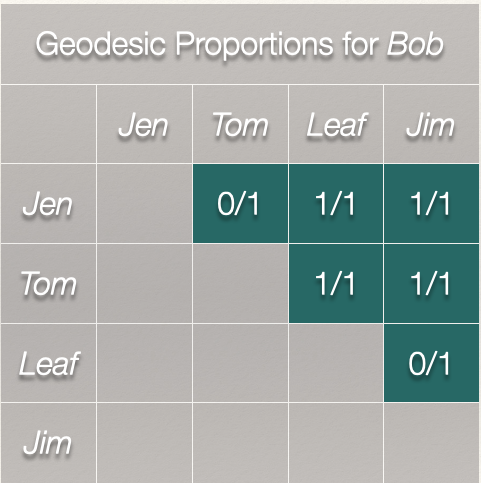
```

<br>

The sum of all these ratios is Bob's betweenness centrality score:

$$C_B(Bob) = \sum\limits_{j<k} g_{jk}(Bob) / g_{jk}$$

That sum is 4. Bob's betweenness centrality score is 4 indicating that he occupies a position between two nodes on 4 of the geodesics in the graph. 

*What about Leaf?*

```{r, fig.cap = "", out.width = "60%"}
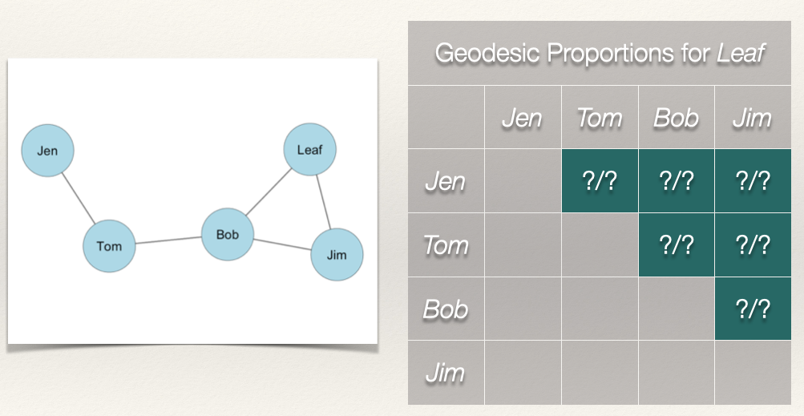
```

<br>

We can see by looking at the plot that Leaf is not on any of the geodesics between Jen, Tom, Bob, and Jim:

<br>

```{r, echo=FALSE, eval=TRUE, fig.width=5, fig.height=5, fig.show="show", fig.align="center"}

par( mar=c( 1, 0.1, 1, 0.1 ) )

set.seed( 19141 )

gplot( u.net, 
       usearrows=FALSE, 
       vertex.cex=3.2, 
       vertex.col = "lightblue", 
       displaylabels = TRUE, 
       label.pos=5, 
       label.cex = 1.5,
       main = "Jen to Tom to Bob to Jim",
       edge.col = c("green","green","grey50","green","grey50" ) )

```

<br>

This means that Leaf's betweenness is zero. We can see this from the completed geodesic proportions table for Leaf:

```{r, fig.cap = "", out.width = "40%"}
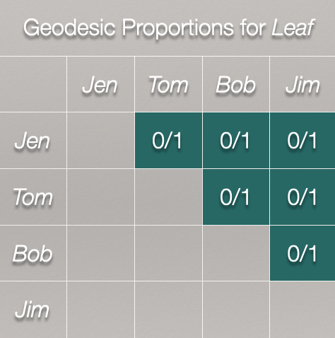
```

<br>
<br>

| Node  | Betweenness |
| :---: | :---------: |
| Jen   | 0           |
| Tom   | 3           |
| Bob   | 4           |
| Leaf  | 0           |
| Jim   | 0           |

<br>
<br>
<hr>

### Standardization

As discussed in the chapter on [degree centrality](), the measure of centrality is affected (effected?) by the size of the graph, *g*. In the case of *closeness* centrality, having to sum over more nodes will push scores closer to zero. This means that we can't compare betweenness centrality scores across graphs of different sizes. *Solution*?

Standardize! If we want to compare nodes in different sized graphs, then we just take into account the number of nodes and the maximum possible nodes to which *i* could be connected. For betweenness centrality, we have to go a step further. We need to account for the number of pairs of nodes that do not include *i*. In an undirected graph, this is $(g-1))(g-2)/2$.

Thus, we can calculate a standardized betweenness centrality score for an undirected graph as:

$$C'_B(n_i) = \frac{\sum\limits_{j<k} g_{jk}(n_i) / g_{jk}}{[(g-1)(g-2)/2]} =  \frac{C_B(n_i)}{[(g-1)(g-2)/2]}$$

So, all we are doing is adjusting each betweenness score by $(g-1))(g-2)/2$.

For this graph, the denominator, $(g-1))(g-2)/2=(5-1))(5-2)/2 = 6$. Plugging that in we get: $$C'_B(n_i) = \frac{C_B(n_i)}{6}$$.

When we calculate the *raw* betweenness scores, we get the following table:

| Node  | Betweenness | Standardized Betweenness |
| :---: | :---------: | :----------------------: |
| Jen   | 0           | 0 / 6 = 0.000 |
| Tom   | 3           | 3 / 6 = 0.500 |
| Bob   | 4           | 4 / 6 = 0.667 |
| Leaf  | 0           | 0 / 6 = 0.000 |
| Jim   | 0           | 0 / 6 = 0.000 |

<br>
<br>
<hr>

### Betweenness Centralization

As we did with [degree centralization]() and [closeness centralization](), we can calculate the betweenness centralization of the graph. Recall that centralization measures the extent to which the nodes in a social network differ from one another in their individual centrality scores. Put differently, how much variation is there in the distribution of centrality scores? As with [closeness centralization](), we use the *standardized* betweenness score (as opposed to the *raw* score).

We can calculate betweenness centralization as:

$$C_B = \frac{\sum\limits_{i=1}^g[C'_B(n^*)-C'_B(n_i)]}{(g-1)} $$
If I lost you in some of the math, don't worry. Let's calculate the betweenness centralization score for our example graph:

```{r, echo=FALSE, eval=TRUE, fig.width=5, fig.height=5, fig.show="show", fig.align="center"}

par( mar=c( 1, 0.1, 1, 0.1 ) )

set.seed( 19141 )

gplot( u.mat, 
       usearrows=FALSE, 
       vertex.cex=3, 
       vertex.col = "lightblue", 
       edge.col="grey50", 
       displaylabels = TRUE, 
       label.pos=5, 
       label.cex = 1 )
```

Recall our table of standardized betweenness scores:

| Node  | Betweenness | Standardized Betweenness |
| :---: | :---------: | :----------------------: |
| Jen   | 0           | 0 / 6 = 0.000 |
| Tom   | 3           | 3 / 6 = 0.500 |
| Bob   | 4           | 4 / 6 = 0.667 |
| Leaf  | 0           | 0 / 6 = 0.000 |
| Jim   | 0           | 0 / 6 = 0.000 |

<br>

*What is the largest standardized betweenness score?* It is 0.667 for Bob. Also, we have $g-1 = 5 - 1 = 4$. Now, we just plug these into our equation:

$$C_B = \frac{\sum\limits_{i=1}^g[0.667-C'_B(n_i)]}{4} $$

<br>

| Node  | Betweenness | Standardized Betweenness | Deviations of Betweenness Closeness, $0.667-C'_B(n_i)$ |
| :---: | :---------: | :----------------------: | :---------------------------------------------------: |
| Jen   | 0           | 0 / 6 = 0.000 | 0.667 - 0.000 = 0.667 |
| Tom   | 3           | 3 / 6 = 0.500 | 0.667 - 0.500 = 0.167 |
| Bob   | 4           | 4 / 6 = 0.667 | 0.667 - 0.667 = 0.000 |
| Leaf  | 0           | 0 / 6 = 0.000 | 0.667 - 0.000 = 0.667 |
| Jim   | 0           | 0 / 6 = 0.000 | 0.667 - 0.000 = 0.667 |

<br>

Now, if we total all of the values in the last column we get 2.168. Plugging this in as our numerator, we get:

$$C_B = \frac{2.168}{4} = 0.542$$

So, the betweenness centralization score for our example graph is 0.542. *What does this mean?*

When betweenness centrality is evenly dispersed, meaning that all nodes have the same betweenness score, then the numerator in the equation will be zero and the quotient will be close to 0. When there is considerable inequality in the betweenness centrality scores between nodes, the quotient will be closer to 1. Thus, closer to 1 indicates that the graph is hierarchically structured and closer to 0 means that the graph is more decentralized.

We can see this by examining two additional undirected networks. 

```{r, echo=FALSE, eval=TRUE, fig.width=5, fig.height=5, fig.show="show", fig.align="center", results="hide"}

centralization( star_net, betweenness, mode="graph" )
centralization( circle_net, betweenness, mode="graph" )

par( mar=c( 0.1,3,0.1,0.1 ), mfrow = c( 1,2 ) )

my_pal <- brewer.pal( 5,"Set2" )

gplot( star_net,
       usearrows=FALSE, 
       displayisolates=FALSE, 
       vertex.cex=3, 
       vertex.col=my_pal[1], 
       edge.lwd=0, 
       edge.col="grey50",
       label=c( "A","B","C","D","E" ),
       label.pos=5 )

gplot( circle_net, 
       usearrows=FALSE, 
       displayisolates=FALSE, 
       vertex.cex=3,
       vertex.col=my_pal[3], 
       edge.lwd=0, 
       edge.col="grey50",
       label=c( "F","G","H","I","J" ),
       label.pos=5 )

```

The closeness centralization score for the figure on the left is `r centralization( star_net, betweenness, mode="graph" )`, whereas the closeness centralization score for the figure on the right is `r centralization( circle_net, betweenness, mode="graph" )`. 

<br>
<br>
<hr>

## Directed Graphs

As discussed in [Chapter 1: Introduction to Social Network Analysis](), when we have a directed graph, we have to consider directionality when evaluating a centrality measure. 

If we are interested in the betweenness score for Bob, we would do the same thing: create a geodesic proportions table for Bob. The difference is that we want to consider the directionality.

Let's take the example that we have been working with for directed graphs and change the layout of the edges slightly (the sociomatrix is the same, just curving the edges in the plot): 

```{r, echo=FALSE, eval=TRUE, fig.width=5, fig.height=5, fig.show="show", fig.align="center"}

par( mar=c( 1, 0.1, 1, 0.1 ) )

set.seed( 19141 )

gplot( 
  d.net, 
  arrowhead.cex = 0.5, 
  vertex.cex=3.2, 
  vertex.col = "orange", 
  usecurve=TRUE, 
  displaylabels = TRUE, 
  label.pos=5, 
  label.cex = 1.5,
  edge.lwd =1.5,
  edge.col = c( "green","green","grey50","grey50","grey50","grey50","green","grey50" ) )


```

*Is Bob on the geodesic between Jen and Jim?* Yes.

```{r, fig.cap = "", out.width = "40%"}
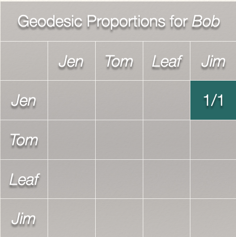
```

<br>

*Is Bob on the geodesic between Jen and Leaf?* Yes. *Jen and Tom?* No.

```{r, fig.cap = "", out.width = "40%"}
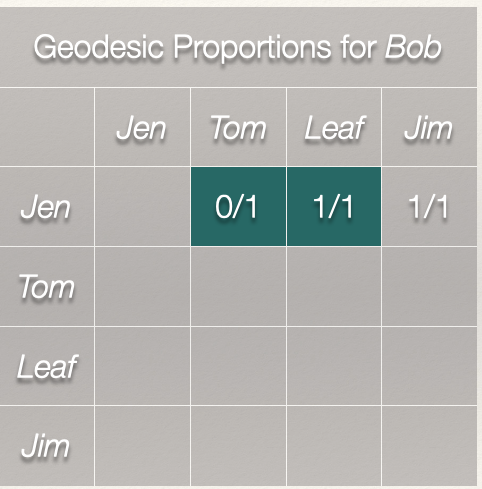
```

<br>

Now, we just need to complete the matrix:

```{r, fig.cap = "", out.width = "40%"}
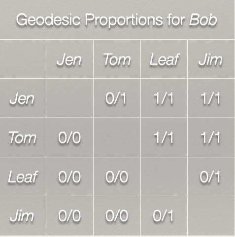
```

<br>

*Why are there no geodesics for Tom to Jen? Leaf to Jen? Leaf to Tom? Jim to Jen? Jim to Tom?* Tom and Jen cannot be reached past Bob, because there are not outgoing ties from Bob. Thus, a geodesic does not exist for these node sets. 

| Node  | Betweenness | Standardized Betweenness |
| :---: | :---------: | :----------------------: |
| Jen   | 0           | 0 / 6 = 0.000 |
| Tom   | 3           | 3 / 6 = 0.500 |
| Bob   | 4           | 4 / 6 = 0.667 |
| Leaf  | 0           | 0 / 6 = 0.000 |
| Jim   | 0           | 0 / 6 = 0.000 |

<br>
<br>
<hr>

## Summary

In this chapter we:

  * Revisited the conceptualization of "centrality" and discussed what it means to be central in terms of being in a position that is between other nodes.
  
  * We also examined the calculation of *betweenness* centrality for undirected and directed graphs.

<br><hr><br>

#### Continue to [Chapter 2: Social Network Analysis and Theory]()

<br><br>

***Please*** report any corrections or comments to the [Issues](https://github.com/jacobtnyoung/sna-textbook/issues) page. Thanks!