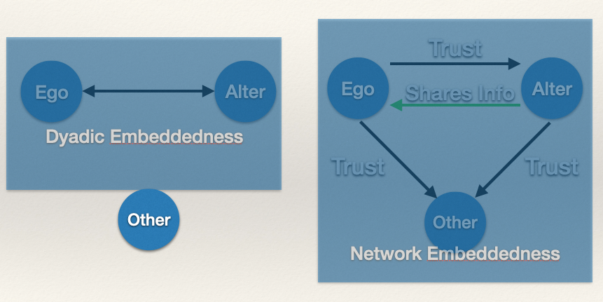

```{r setup, include=FALSE}
knitr::opts_chunk$set(
  echo = FALSE, 
  message=FALSE, 
  warning=FALSE, 
  fig.width = 10
  )
library( here )
```

<br>

# Chapter 13: Exponential Random Graph Models

<br>

## Learning Goals

By the end of this chapter, you should be able to answer the following questions:

  * What is the underlying logic of exponential random graph models (ERGMs)?
  * What is the historical development of ERGMs and what are the various properties of the models that were developed over time?
  * What are *network configurations* and how do they help us operationalize theoretical concepts?

----

## Motivating Example

A longstanding finding in research on women's prisons is that trust plays a central role in the setting. But, little work has sought to undertand how trust comes about and how it is organized. A basic question in this literature is why women trust each other? A To get at this issue, [Young & Haynie (2022)](https://www.tandfonline.com/doi/full/10.1080/07418825.2020.1807588), in an article entitled [Trusting the Untrustworthy: The Social Organization of Trust Among Incarcerated Women](https://www.tandfonline.com/doi/full/10.1080/07418825.2020.1807588) started by asking a basic question: "what does it **mean** to trust someone?" Their point was that it is necessary to use precise language when seeking to understand trust in a particular context. To accomplish this goal, they created an instrument whereby trust ins conceptualized as a three-part system: A trusts B to do X. Specifically, they operationalized trust by asking women in a prison unit whom they trusted to protect them during an argument or a dispute. This produced a directed network of trust relationships. Then, the authors asked: "why do women trust each other in prison?". You may trust people who are like you (e.g. same age, same religion). But, another way that trust may come about is through social structural arrangements. Specifically, they tested whether trust is likely to come about through two mechanisms identified by [Buskens (2002)]() and [Buskens and Raub (2002)](): *dyadic embeddedness* and *network embeddedness*.

**Dyadic embeddedness** involves a reciprocal process by which individuals exchange information about the trustworthiness of each other. The exchange results in a mutual trust relationship where prisoner *i* is more likely to trust prisoner *j* because *j* trusts *i*. **Network embeddedness** refers to the situation where an individual may learn about the trustworthiness of another through a third-party as opposed to the direct communication that occurs with dyadic embeddedness. For example, *i* may trust *j* because of information received through interpersonal discussion of *j* through a third-party, *k*. In this way, information about the trustworthiness of another person is received indirectly. 

```{r, fig.cap = "", out.width = "30%"}

```

The authors tested this by examining two networks structures:  

  + whether *i* is more likely to trust *j* if *j* trusts *i* (dyadic embeddedness)  
  + whether *i* is more likely to trust *j* if a) *i* trusts *k* and *k* trusts *j* and b) *k* shares information with *i* (network embeddedness)

Testing these hypotheses, the authors found support for both mechanisms.

<br>

# Introduction

In the prior chapters, we have mainly been doing *descriptive statistics* with network data. That is, seeing how we work with build network data structures and describing the properties of those networks. For example, the question "how are the degrees distributed in this network?" is a descriptive question in that we are describing the distribution of ties.

In this and subsequent chapters, we will shift toward *inferential statistics* where we test hypotheses on networks. For example, the question "is the distribution of degrees different from a network where ties form at random?" is a hypothesis and we need a modeling framework for testing this hypothesis.

This provides a whole new body of questions that we can ask:  

  * How do networks form?  
  * What are the micro patterns that generate global structure? 
  * How likely is it that we would observe these configurations if ties formed at random?

In this chapter we will explore **Exponential Random Graph Models** or ERGMs, which provide a model (an account of what governs the formation of a network) for examining such questions.

<br>

# Modeling Networks

Why should we care? Why not be satisfied with descriptive statistics? There are several reasons:

  * Complexity and randomness-the world is messy and we would like to express with some precision how sure we are about some observation we have.
  * Statistical inference and hypothesis testing-we want to be able to specify a hypothesis and determine whether we can reject that hypothesis based on the data.
  * Global structure from local structure (micro-macro problem)-many structures we observe in networks are a consequence of local structural configurations. We could get the same global structure from different local processes, so we want to be able to examine these situations.

So, we want to go beyond *description*. We want to develop an explanation of what produced the observed network. Life is complex, and we want to recognize that our observed data was generated through some stochastic process and to test hypotheses about substructures that generated the global structure.

<br>

## Logic of Random Graph Modeling

I am going to preface this with a bit of a warning. ERGMs can be tough to wrap your mind around the first time you encounter them. But, we will take small steps as we go through this. Just hang in there and stick with me!

To get us started, think about the basic problem we are trying to resolve: We have an *observed* network, and want to know about the *stochastic* process by which it came about.

### Analogy

Here is a conceptual analog that should be familiar. Let's walk through it and tie it back to how we are thinking about ERGMs.

Suppose we are sampling from a normal distribution. That is a variable that looks like a bell-curve. If we randomly sampled a group of people from the distribution, we could calculate the mean. We could repeat this process. Each time we repeat the sampling procedure we don’t get the exact same data (i.e. sample statistics differ from population parameters). **However**, there is some process generating our sample statistics (i.e. central tendency and dispersion).

To see what I mean, let's simulate some examples. First, let's randomly draw 100 values from a distribution that has a mean of 0 and a standard deviation of 1. Then, calculate the mean. In the plot below, we do this once and the mean is the black vertical line.

```{r}

# plot a random draw.
set.seed( 1 )
dat <- rnorm( 100, 0, 1 )
hist( dat, col = "lightblue", xlab = "" )
abline( v = mean( dat ), lwd = 4 )

```

The sample mean is `r round( mean( dat ), 2 )`. Let's do it again:

```{r}

# plot a random draw.
set.seed( 2 )
dat2 <- rnorm( 100, 0, 1 )
hist( dat2, col = "lightgreen", xlab = "" )
abline( v = mean( dat2 ), lwd = 4 )

```

The sample mean is `r round( mean( dat2 ), 2 )`. Let's do it again:

```{r}

# plot a random draw.
set.seed( 3 )
dat3 <- rnorm( 100, 0, 1 )
hist( dat3, col = "orange", xlab = "" )
abline( v = mean( dat3 ), lwd = 4 )

```

The sample mean is `r round( mean( dat3 ), 2 )`. Let's do it again:


```{r}

# plot a random draw.
set.seed( 4 )
dat4 <- rnorm( 100, 0, 1 )
hist( dat4, col = "firebrick", xlab = "" )
abline( v = mean( dat4 ), lwd = 4 )

```

The sample mean is `r round( mean( dat4 ), 2 )`. Know, let' see them all together:

```{r}

# plot them all
par( mfrow = c( 2,2 ) )

hist( dat, col = "lightblue", xlab = "" )
abline( v = mean( dat ), lwd = 4 )

hist( dat2, col = "lightgreen", xlab = "" )
abline( v = mean( dat2 ), lwd = 4 )

hist( dat3, col = "orange", xlab = "" )
abline( v = mean( dat3 ), lwd = 4 )

hist( dat4, col = "firebrick", xlab = "" )
abline( v = mean( dat4 ), lwd = 4 )

```

As we seen, the data in each sample are drawn from the exact same distribution, but the sample mean varies. This is just random variation created by the sampling process.

In a similar way, when we think about networks through an *inferential* lens, we want to examine the parameters which generate the network we have observed. Did it come about because people:  

* Reciprocate relationships?  
* Nominate popular others?  
* Close triads?

<br>

## Example: Random or Patterned?

```{r}

library( sna )
library( ergm )

# simulate the network
set.seed( 605 )
simMat <- rgraph( 100, tprob = 0.02, mode = "graph" )

simNet <- as.network( simMat, directed = FALSE )

simNet %v% "var" <- nodeAtt <- c( 
  rep( 0, dim( simMat )[1] / 2 ),  
  rep( 1, dim( simMat )[1] / 2 )
  )


!!HERE

n <- dim( simMat )[1]

mmRatio <- sum( diag( mixingmatrix( simNet, "var" ) ) ) / mixingmatrix( simNet, "var" )[2,1] + mixingmatrix( simNet, "var" )[1,2]

while ( mmRatio < 1 ){
  if( sum( diag( mixingmatrix( simNet, "var" ) ) ) > mixingmatrix( simNet, "var" )[2,1] + mixingmatrix( simNet, "var" )[1,2]) {
    add.edge( simNet, sample( seq( 1:n ), sample( seq( 1:n ), 1 ) ) )
    } else{
      delete.edges( simNet, sample( seq( 1:n ), sample( seq( 1:n ), 1 ) ) )
    }
  }


add.edge( simNet, sample( seq( 1:n ), sample( seq( 1:n ), 1 ) ) )


mod <- ergm( simNet ~ edges + nodematch( "var" ) )

summary( mod )

gplot( simNet, gmode = "graph", vertex.col = simNet %v% "var" )


a <- simulate( mod )

mixingmatrix( simNet, "var" )

mixingmatrix( simNet, "var" )[2,1] + mixingmatrix( simNet, "var" )[1,2]

HERE With trying to work through this

```

<br>

----

##### Summary

Summary

In the next chapter, ...

<br>

#### Continue to [Chapter 14: ]()

<br>
<br>

***Please*** report any corrections or comments to the [Issues](https://github.com/jacobtnyoung/sna-textbook/issues) page. Thanks!

<br>
<br>